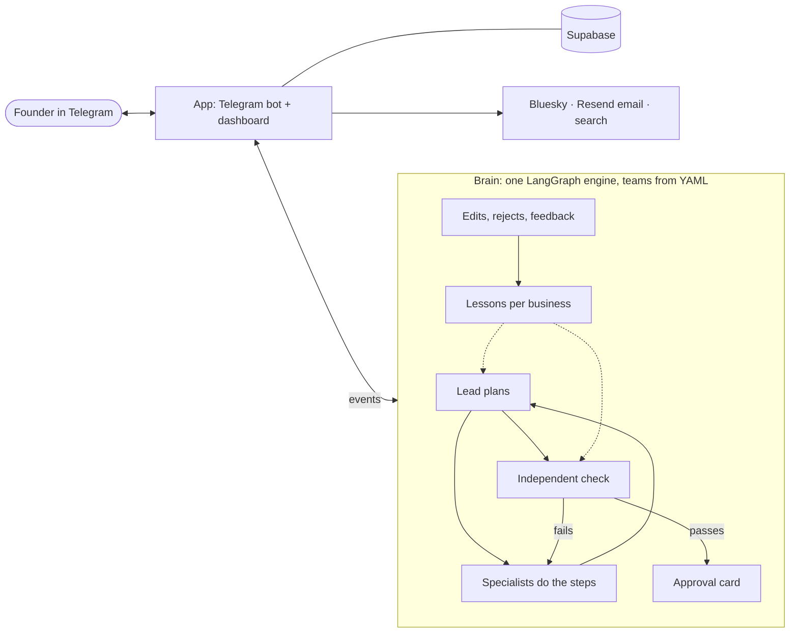

# Tenure

> **We don't sell agents. We sell you a team.**

Solo founders hire AI teams that live in their Telegram, learn the business once, get better with every piece of feedback, and earn autonomy one approved task at a time.

## Hackathon

**Innovation Intelligence Hackathon** · UC Berkeley · SF Tech Week, Oct 5–11, 2026 · Track: **AI-Native Enterprise**

## Team: Punto Medio

| Member | Role |
| --- | --- |
| **Juan Ignacio Llaberia** ([@JuaniLlaberia](https://github.com/JuaniLlaberia)) | Agent brain: LangGraph engine, prompts, team templates, onboarding, learning, autonomy |
| **Mark Mysler** ([@markmysler](https://github.com/markmysler)) | App: Telegram bot, dashboard, Supabase, integrations (Bluesky, email, search) |

## What we built

Owners of the 30M+ US businesses with no employees are experts at one thing and amateurs at everything else, and they don't trust AI with their brand or their customers. Today's AI tools either hand you drafts or act without asking; nothing earns trust the way a new hire does. **Tenure gives a solo founder AI teams that work like new employees.** Each team lives in a topic of the founder's Telegram group and learns the business once. It turns every edit, rejection and comment into a lesson, so it keeps getting better at *this* founder's business. It starts on probation, and trust is earned per task type: after a streak of clean approvals, the team asks for more autonomy, and the founder can take it back at any time. The bottleneck isn't what AI can do; it's what owners will let it do.

**Who it's for:** established solo service businesses, such as a consultant, designer or coach earning $100K+ a year, who have no time or skill for marketing.

**What works today:** a chief of staff that onboards the business, a **Marketing** team (Maya: Bluesky posts, newsletters, competitor checks) and a **Design** team (Iris: on-brand images), which can work together on one campaign. Approvals, undo, an audit log, learning, the autonomy ladder, schedules, voice notes, photos and PDFs in, and a dashboard.

## How it works

1. **Onboard once.** In the company group's General topic, Alex (chief of staff) interviews the founder until the business profile is complete. Paste a website or send a PDF to fill it faster.
2. **Hire a team.** `/hire marketing` creates the team's own topic. The lead asks only 2–3 role-specific questions; everything else comes from the shared business memory.
3. **Ask for work.** "We launch Friday, get the word out" (typed or as a voice note). The lead splits it into tasks, each task runs through fixed steps done by specialists (researcher → writer), and control always returns to the lead.
4. **Independent check.** A separate reviewer grades every draft against the task's rules and the team's lessons before the founder sees it. Failed drafts go back for revision.
5. **Approve, Edit or Reject in Telegram.** On approval the real action runs: a Bluesky post or an email. Every action is logged, and posts can be undone for 10 minutes.
6. **The team learns.** Edits, rejection reasons and chat feedback ("no hashtags") become lessons for this business, which the founder can see and delete. The lead confirms what it learned.
7. **It earns autonomy.** After a streak of clean approvals on a task type, the team asks to act without asking on that task type only. The ladder is `draft_only` → `act_after_approval` → `act_and_report` → `autonomous`.

## Demo video

▶ [Watch the demo on YouTube](https://www.youtube.com/watch?v=_aEoSzCfK34)

## Run it yourself

Nothing is hosted: you run your own copy. **[INSTRUCTIONS.md](INSTRUCTIONS.md)** has the setup (keys, Supabase, Telegram bot), three ways to try it, and a walkthrough of the demo.

## What makes it different

- **Trust is earned, per task type.** Approval and autonomy rules are plain code, not LLM judgments. A team can post on its own and still ask before every newsletter.
- **Teams learn each business.** Two businesses hire the same Marketing template, and the teams drift apart as each founder gives feedback.
- **Teams are data, not code.** Every team runs on the same engine. A new team is a YAML file listing its specialists, task types, steps, checks and actions.
- **Decisions vs. work.** LLMs write and plan. Routing and yes/no calls (is it clear? does the draft pass?) go through Jev by TypeSafe AI, with confidence scores; below the threshold the system takes the safe path.

## Built with

Python 3.12 · uv · LangGraph · OpenRouter (DeepSeek, Claude, Gemini, Jev by TypeSafe AI) · python-telegram-bot · FastAPI · Supabase (Postgres and Storage) · Bluesky (atproto) · Resend · Keenable search.

## Docs

- [docs/CONTEXT.md](docs/CONTEXT.md): what we're building and why
- [docs/CONTRACT.md](docs/CONTRACT.md): the interface between the brain and the app
- [docs/specs/brain-engine.md](docs/specs/brain-engine.md): the team engine
- [docs/ROADMAP.md](docs/ROADMAP.md) and [docs/brain/](docs/brain/): how it was built, stage by stage

## Architecture

The app never calls an LLM, and the brain never touches Telegram or the database directly: they meet at a typed contract (`src/contract/`). The brain streams events back to the app, and real actions run only after approval (or when the task type has earned the autonomy).
